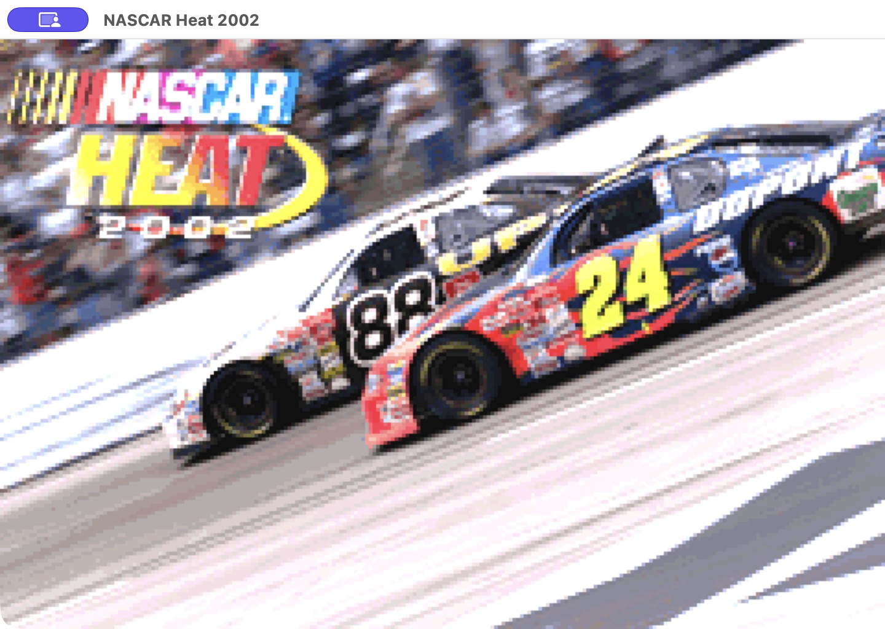

<h1 align="center">NASCAR Heat 2002</h1>

<p align="center">
  
  <br>
</p>

A matching decompilation of NASCAR Heat 2002 (USA) for Game Boy Advance,
with an SDL2 desktop port.

The GBA build reproduces the retail ROM byte for byte. Run `make check` to
verify it. Game assets are not included. You must supply your own ROM.

## Build the GBA ROM

You need Git, Make, Python 3, a C compiler, a C++17 compiler, and ARM binutils.

On macOS:

```sh
xcode-select --install
brew install arm-none-eabi-binutils
```

On Debian or Ubuntu:

```sh
sudo apt-get install git build-essential python3 binutils-arm-none-eabi
```

Clone the repository and build the compiler:

```sh
git clone --recursive https://github.com/shohamc1/heat2002-gba.git
cd heat2002-gba
(cd tools/agbcc && ./build.sh)
```

Copy your USA ROM to `baserom.gba`. It must have these properties:

| Property | Value |
| --- | --- |
| Size | 4,194,304 bytes |
| SHA-1 | `0eb1fa43d8b0f8a6fb1e3ac04f7bba92c7cbac96` |
| Game code | `ANHE` |

Verify the input, then build:

```sh
shasum -c nascar-heat.sha1.baserom
make check
```

The output is `nascar-heat.gba`. A correct build prints `MATCH`.

## Build the desktop port

Install SDL2 (`brew install sdl2` or `sudo apt-get install libsdl2-dev`).
Then run:

```sh
make sdl
./build/sdl/nascar-heat.sdl
```

The port uses the same source and assets as the GBA build. Saves go to
`nascar-heat.sav` in the current directory.

| Control | Keyboard |
| --- | --- |
| Throttle / brake | W / S, or C / X |
| Steering | A / D |
| Menu navigation | Arrow keys |
| L / R | Q / E |
| Start / pause | Enter or Esc |
| Select | Tab |

SDL gamepads are supported. The left stick steers. The triggers control
throttle and brake.

### Windows

Cross-compile with MinGW-w64 and the
[SDL2 MinGW development package](https://github.com/libsdl-org/SDL/releases).
Set `prefix=` in `x86_64-w64-mingw32/bin/sdl2-config` to the extracted
SDL2 directory for that target.

```sh
make PLATFORM=sdl CC_H=x86_64-w64-mingw32-gcc CXX_H=x86_64-w64-mingw32-g++ \
     AS_H=x86_64-w64-mingw32-as LD_H=x86_64-w64-mingw32-ld \
     SDL2_CONFIG=/path/to/SDL2-<version>/x86_64-w64-mingw32/bin/sdl2-config
```

The output is `build/sdl-windows/nascar-heat.sdl.exe`. Keep the copied
`SDL2.dll` beside it.

## Edit assets

The first build extracts editable assets into `assets/`: graphics as PNGs,
tracks as Tiled maps, music as MIDI, and samples as AIFF. Edit them and run
`make` to rebuild. Edited assets change the ROM and will fail `make check`.

Extracted files are ignored by Git. `make clean` preserves them. Delete an
edited file and rebuild to restore it from your ROM.

## Contributing

Keep changes focused. Run `make check` before submitting a change to the GBA
build. Use [GitHub issues](https://github.com/shohamc1/heat2002-gba/issues) for
bugs and planned work.

## Credits

- [agbcc](https://github.com/Dream-Atelier/agbcc) supplies the compiler.
- [pret/pokeemerald](https://github.com/pret/pokeemerald),
  [fireemblem8u](https://github.com/laqieer/fireemblem8u), and
  [kl-eod-decomp](https://github.com/Dream-Atelier/kl-eod-decomp) supply GBA
  headers and SDK library sources.
- [zeldaret/tmc](https://github.com/zeldaret/tmc) supplies asset tools.
- [SAT-R/sa2](https://github.com/SAT-R/sa2) supplies the basis for the desktop
  platform layer. Its gpSP renderer is GPL-2.0-or-later. The linked desktop
  executable is subject to that license. The gbagfx code carries its MIT
  license in `src/platform/ext/gbagfx/LICENSE`.
